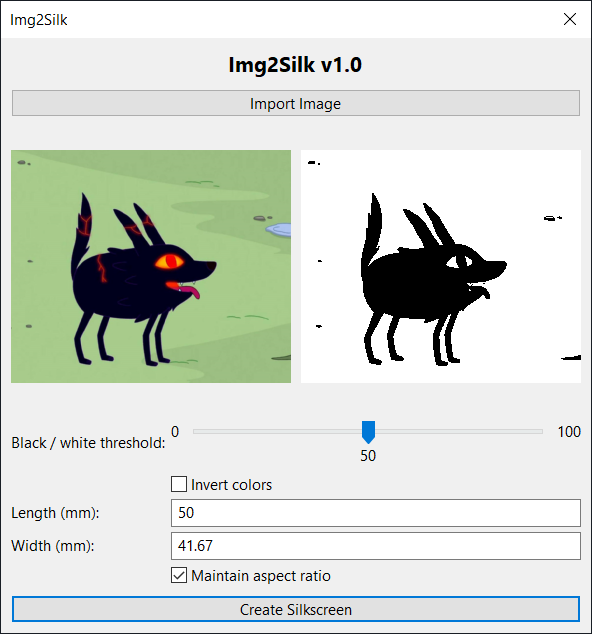
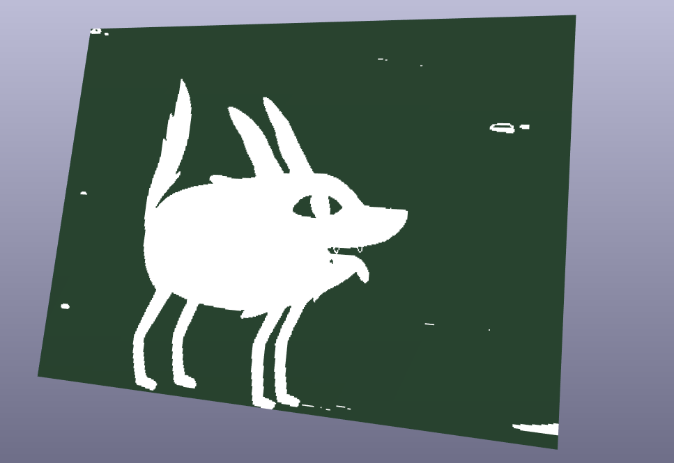

# Img2Silk

## Features

- Import and convert images to silkscreen directly in KiCad.
- Adjust size, black / white threshold, and other settings before placing the image.
- No external image editor required.

## Installation

1) Download the [latest release ZIP file](https://github.com/NBalciunas/kicad-img2silk/releases).
2) Open KiCad and in the main window click on "Plugin and Content Manager".
3) Click "Install from File..." and select the downloaded ZIP file.  
4) Restart KiCad — the plugin is now installed.

## Usage

1) Click **Import Image** to load the artwork you want to convert into a silkscreen footprint.
2) Use the **Black / white threshold** slider to control how the image is converted to pure black and white.
3) Enable **Invert colors** if the silkscreen comes out inverted (black/white swapped) from what you want.
4) Enter the desired **Length (mm)** and **Width (mm)** for the final footprint.
5) Keep **Maintain aspect ratio** checked to scale proportionally, or uncheck it to set width and height independently.
6) Click **Create Silkscreen** to generate and place the footprint.

## Example

The following example shows a generated silkscreen footprint using the specified parameters from the **Usage** section.

This illustrates how the silkscreen is created in both 2D and 3D views, ready for placement on the PCB.

## License

This project is licensed under the MIT License.
Copyright © 2026 Nojus Balčiūnas